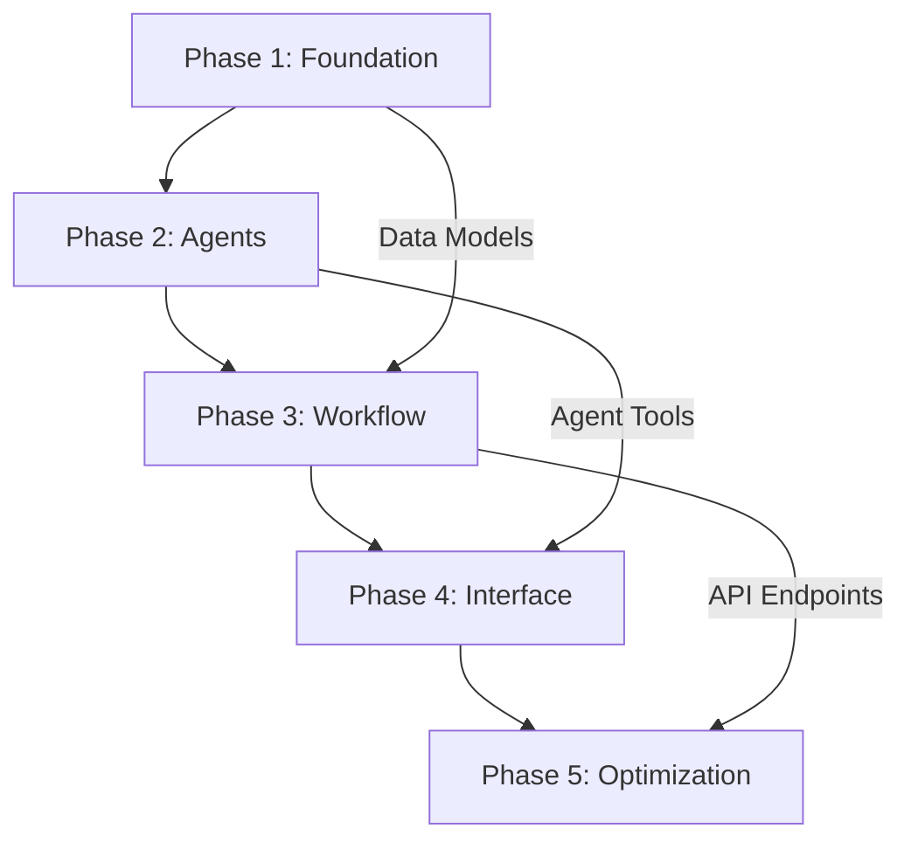

# LLM as a Judge - Master Plan
*Accessibility Remediation Plan Evaluator*

## Executive Summary

This master plan outlines the development of a sophisticated "LLM as a Judge" application using CrewAI to **evaluate and compare** accessibility remediation plans. The system leverages Gemini Pro and GPT-4 as expert judges to provide comprehensive, unbiased **comparative evaluations and scoring** based on the evaluation framework in `promt/eval-prompt.md`.

## Project Overview

### Vision
Create an automated system that acts as an **expert judge** to evaluate multiple accessibility remediation plans against each other, providing detailed scoring, comparative analysis, and recommendations for improvement based on established criteria.

### Core Value Proposition
- **Comparative Evaluation**: Score and rank remediation plans using weighted criteria
- **Multi-Judge Validation**: Cross-validation between Gemini and GPT-4 for robust evaluations  
- **Expert Analysis**: Detailed assessment using Strategic Prioritization (40%), Technical Specificity (30%), Comprehensiveness (20%), Long-Term Vision (10%)
- **Professional Scoring Reports**: Comprehensive evaluation reports with scores, pros/cons, and gap analysis
- **Objective Decision Making**: Transform subjective plan selection into data-driven recommendations

## Architecture Overview

```
┌─────────────────┐    ┌─────────────────┐    ┌─────────────────┐
│   Input Layer   │    │  CrewAI Core    │    │  Output Layer   │
│                 │    │                 │    │                 │
│ • Audit Report  │────▶│ • Judge Agents  │────▶│ • Evaluation    │
│ • Remediation   │    │ • Scoring Tasks │    │   Reports       │
│   Plans (A-G)   │    │ • Comparison    │    │ • Scores &      │
│ • Eval Prompt   │    │   Tools         │    │   Rankings      │
│                 │    │ • Workflows     │    │ • PDF Reports   │
└─────────────────┘    └─────────────────┘    └─────────────────┘
                              │
                              ▼
                    ┌─────────────────┐
                    │  Judge LLMs     │
                    │                 │
                    │ • Gemini Pro    │
                    │ • GPT-4/4o      │
                    └─────────────────┘
```

## Technology Stack

### Core Framework
- **CrewAI**: Multi-agent orchestration and workflow management
- **Python 3.9+**: Primary development language
- **FastAPI**: REST API for web interface (optional)
- **Streamlit**: User interface for plan evaluation

### LLM Integration
- **Google Gemini Pro**: Primary judge LLM
- **OpenAI GPT-4/4o**: Secondary judge LLM
- **LangChain**: LLM abstraction and prompt management
- **Pydantic**: Data validation and settings management
- **Existing Evaluation Framework**: Uses `promt/eval-prompt.md` as core guidance

### Data Processing
- **PyPDF2/pdfplumber**: PDF parsing for audit reports and plans
- **ReportLab/WeasyPrint**: PDF generation for professional reports
- **Matplotlib/Plotly**: Charts and visualizations for reports
- **Pandas**: Data manipulation and analysis
- **JSON**: Structured output format

## Project Structure

```
accessibility-eval-crew-two/
├── src/
│   ├── agents/              # CrewAI agent implementations
│   ├── tasks/               # Task definitions for workflow
│   ├── tools/               # Custom tools for agents
│   ├── models/              # Pydantic data models
│   ├── config/              # Configuration management
│   ├── batch/               # Batch processing system
│   ├── consensus/           # Advanced consensus mechanisms
│   ├── monitoring/          # Performance monitoring
│   ├── reports/             # PDF report generation system
│   │   ├── generators/      # Report generators
│   │   ├── templates/       # Report templates
│   │   └── utils/           # Report utilities
│   └── utils/               # Utility functions
├── app/
│   ├── main.py              # Streamlit interface
│   └── api.py               # FastAPI endpoints (optional)
├── tests/                   # Comprehensive test suite (TDD)
│   ├── conftest.py          # PyTest configuration and fixtures
│   ├── unit/                # Unit tests (70% of test coverage)
│   │   ├── test_pdf_parser.py
│   │   ├── test_llm_config.py
│   │   ├── test_judge_agent.py
│   │   ├── test_evaluation_tools.py
│   │   └── test_models.py
│   ├── integration/         # Integration tests (20% of test coverage)
│   │   ├── test_workflow.py
│   │   ├── test_agent_interactions.py
│   │   └── test_llm_integrations.py
│   ├── e2e/                 # End-to-end tests (10% of test coverage)
│   │   ├── test_complete_workflow.py
│   │   └── test_user_scenarios.py
│   ├── ui/                  # UI component tests
│   │   └── test_streamlit_app.py
│   └── performance/         # Performance and load tests
│       ├── test_performance.py
│       └── test_batch_processing.py
├── data/                    # Existing data directory
├── docs/                    # Developer documentation and references
│   ├── architecture/        # System architecture documentation
│   ├── development/         # Developer guides and setup
│   ├── api-reference/       # API and component documentation
│   ├── examples/            # Code examples and templates
│   ├── troubleshooting/     # Problem-solving guides
│   └── reference/           # Quick reference materials
├── output/                  # Generated evaluations and reports
│   ├── evaluations/         # JSON evaluation results
│   ├── reports/             # Generated PDF reports
│   └── synthesis/           # Synthesized optimal plans
├── templates/               # Report templates and assets
│   ├── pdf/                 # PDF report templates
│   ├── css/                 # Styling for reports
│   └── images/              # Report assets and logos
├── plans/                   # Project documentation (this directory)
├── .github/workflows/       # CI/CD pipeline
│   └── tdd-pipeline.yml
├── requirements.txt
├── requirements-test.txt    # Testing dependencies
├── .env.example
├── pytest.ini              # PyTest configuration
├── .coverage               # Coverage configuration
└── README.md
```

## Implementation Strategy

The project is structured as a **5-phase development cycle** with working prototypes at each stage, following **Test-Driven Development (TDD)** principles throughout:

### [Phase 1: Foundation & Setup](./phase-1-foundation.md) (Week 1)
- Environment setup and dependencies
- Data processing pipeline
- Basic LLM integration
- **TDD Focus**: Unit tests for core components (PDF parsing, LLM connections)
- **Deliverable**: Working PDF parser and LLM connections with comprehensive test coverage

### [Phase 2: Core Agent Development](./phase-2-agents.md) (Week 2)
- Judge agent implementation (Gemini Pro & GPT-4)
- Evaluation and scoring agents  
- Comparative analysis tools
- **TDD Focus**: Agent behavior testing, mock LLM responses, scoring validation
- **Deliverable**: Functional evaluation agents with deterministic scoring test suite

### [Phase 3: CrewAI Workflow Integration](./phase-3-workflow.md) (Week 3)
- Comparative evaluation workflow
- Multi-judge coordination and consensus
- Scoring aggregation and conflict resolution
- **TDD Focus**: Integration testing, workflow orchestration, scoring consistency
- **Deliverable**: End-to-end evaluation pipeline with robust scoring validation

### [Phase 4: User Interface Development](./phase-4-interface.md) (Week 4)
- Streamlit web application
- Interactive dashboards
- Export functionality
- **TDD Focus**: UI component testing, user interaction validation, E2E scenarios
- **Deliverable**: Complete user interface with automated UI testing

### [Phase 5: Advanced Features & Optimization](./phase-5-optimization.md) (Week 5)
- Multi-judge consensus mechanisms
- Batch processing capabilities
- Performance optimization
- **TDD Focus**: Performance testing, load testing, regression prevention
- **Deliverable**: Production-ready system with comprehensive test automation

**For detailed TDD implementation strategy, see [TDD Strategy Document](./tdd-strategy.md)**

## Key Components

### Agent Architecture
- **Primary Judge Agent (Gemini Pro)**: Main evaluation engine
- **Secondary Judge Agent (GPT-4)**: Cross-validation and consensus
- **Synthesis Agent**: Optimal plan generation
- **Coordinator Agent**: Workflow management

### Evaluation Framework Integration
The system integrates directly with the existing `promt/eval-prompt.md` framework:
- **Strategic Prioritization (40%)**
- **Technical Specificity (30%)**
- **Comprehensiveness (20%)**
- **Long-term Vision (10%)**

### Quality Assurance

#### Core Quality Standards
- Multi-judge validation with >85% consensus target
- Automated conflict resolution
- Expert synthesis recommendations

#### Test-Driven Development
- **TDD Strategy**: [`/plans/tdd-strategy.md`](./tdd-strategy.md)
- **Test Pyramid**: 70% unit, 20% integration, 10% e2e tests
- **Coverage Target**: 95%+ code coverage
- **Mock Strategies**: Comprehensive LLM testing approaches

#### Enhanced Quality Gates
- **Quality Framework**: [`/plans/enhanced-quality-gates.md`](./enhanced-quality-gates.md)
- **Security Gates**: Authentication, data protection, compliance
- **Performance Gates**: Response times, scalability, resource usage
- **Reliability Gates**: Error handling, fault tolerance, monitoring
- **Business Gates**: Requirements validation, stakeholder approval

#### Professional Reporting
- **PDF Reports**: [`/plans/pdf-report-implementation.md`](./pdf-report-implementation.md)
- **Report Types**: Executive, Detailed, Comparative, Synthesis
- **Professional Layout**: Enterprise-grade formatting and presentation
- **Chart Integration**: High-quality visualizations and analytics

#### Continuous Integration
- Automated testing pipeline with performance benchmarks
- Red-Green-Refactor cycle ensuring reliable, maintainable code

## Success Metrics

### Evaluation Quality
- Judge consensus rate (target: >85%)
- Expert validation of synthesis plans
- User satisfaction with recommendations
- Implementation success rate

### Performance Metrics
- Average evaluation time per plan
- System uptime and reliability
- API response times
- User engagement metrics

## Risk Mitigation

### Technical Risks
- **LLM API Availability**: Fallback mechanisms and retry logic
- **Rate Limiting**: Smart queuing and load balancing
- **Data Processing Errors**: Robust error handling
- **Performance Degradation**: Monitoring and alerting

### Business Risks
- **Evaluation Accuracy**: Multi-judge validation and expert review
- **User Adoption**: Intuitive interface and clear value proposition
- **Compliance Issues**: Regular accessibility standard reviews

## Dependencies and Prerequisites

### External APIs
- Google AI Studio account (Gemini Pro access)
- OpenAI API account (GPT-4 access)
- Appropriate API quotas for development and production

### Data Requirements
- Accessibility audit reports (PDF format)
- Remediation plans A-G (PDF format)
- Existing evaluation framework (`promt/eval-prompt.md`)

### Technical Requirements
- Python 3.9+ development environment
- 8GB+ RAM for local development
- Cloud hosting for production deployment

## Phase Dependencies



## Next Steps

1. **Review Master Plan**: Ensure alignment with project goals
2. **Begin Phase 1**: Follow [Phase 1 Implementation Plan](./phase-1-foundation.md)
3. **Set Up Development Environment**: Configure Python, APIs, and tools
4. **Establish Testing Strategy**: Implement continuous validation

## Document Cross-References

- **Detailed Phase Plans**: [Phase 1](./phase-1-foundation.md) | [Phase 2](./phase-2-agents.md) | [Phase 3](./phase-3-workflow.md) | [Phase 4](./phase-4-interface.md) | [Phase 5](./phase-5-optimization.md)
- **Development Strategy**: [TDD Strategy](./tdd-strategy.md) - Comprehensive Test-Driven Development approach
- **Quality Assurance**: [Enhanced Quality Gates](./enhanced-quality-gates.md) - Comprehensive quality framework
- **Report Generation**: [PDF Report Implementation](./pdf-report-implementation.md) - Professional report generation system
- **Risk Management**: [Pre-Mortem Analysis](./pre-mortem-analysis.md) - Proactive risk identification and mitigation
- **Project Assessment**: [Final Review](./final-review-assessment.md) - Comprehensive project alignment review
- **Documentation Strategy**: [Documentation Strategy](./documentation-strategy.md) - Developer reference and Copilot assistance
- **Security & Privacy**: [Data Privacy & Security Strategy](./data-privacy-security-strategy.md) - Comprehensive data protection framework
- **Judge Consensus**: [Judge Disagreement & Consensus Strategy](./judge-consensus-strategy.md) - Multi-level conflict resolution system
- **Evaluation Quality**: [Evaluation Objectivity & Golden Standard Strategy](./evaluation-objectivity-strategy.md) - Judge calibration and validation framework
- **Technical Specifications**: [Data Models](./technical-specs.md)* | [API Documentation](./api-specs.md)*
- **Testing Strategy**: [Test Plans](./testing-strategy.md)*
- **Deployment Guide**: [Deployment Options](./deployment-guide.md)*

*\*Documents to be created during implementation phases*

---

*This master plan serves as the central coordination document for the LLM as a Judge project. All phase plans reference back to this document for consistency and alignment.*
